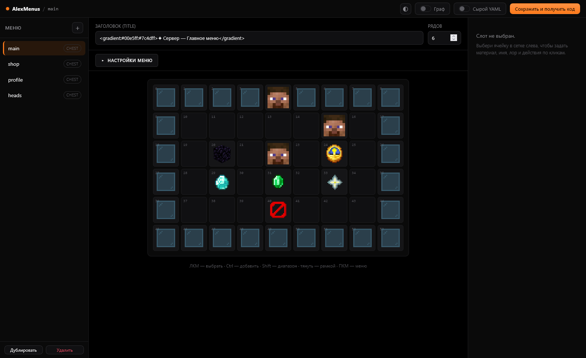
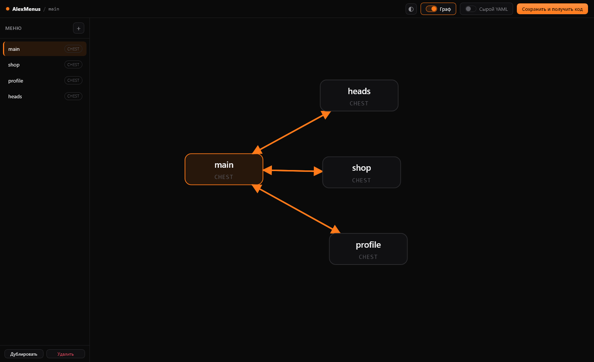
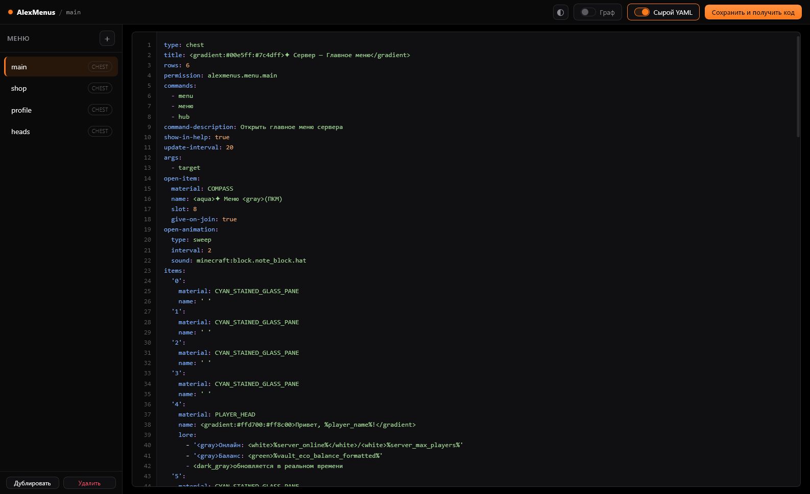
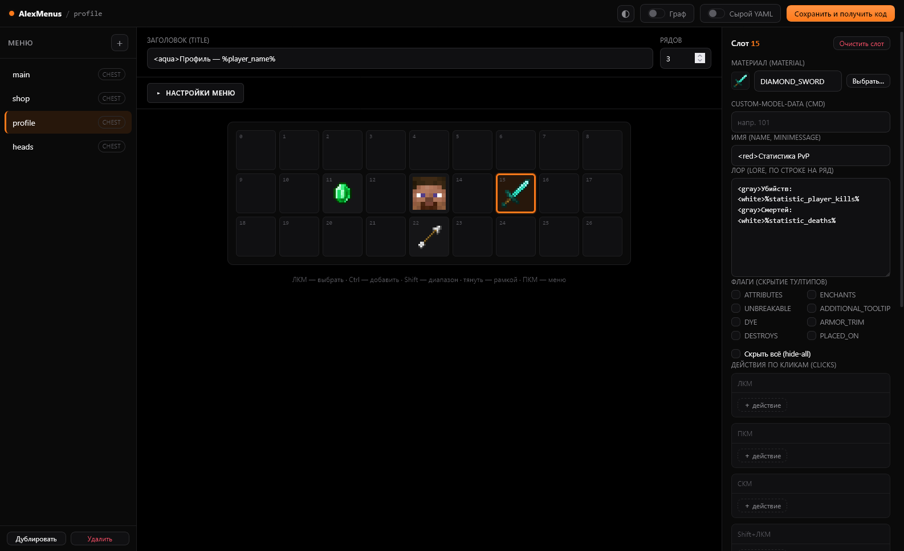
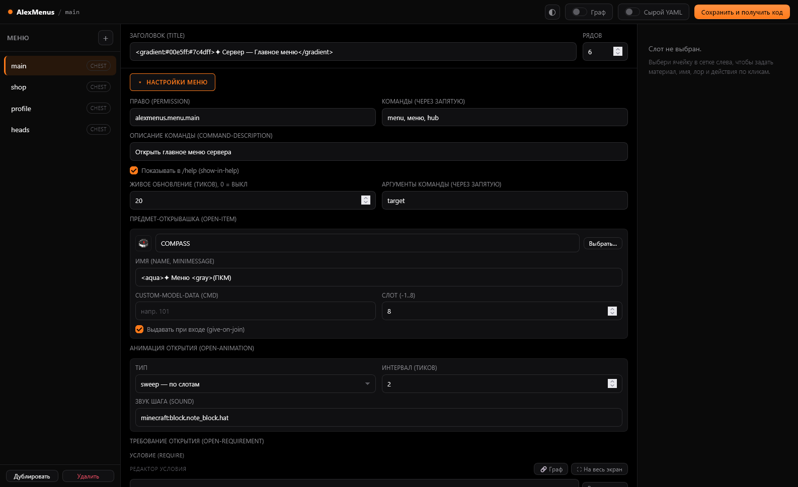
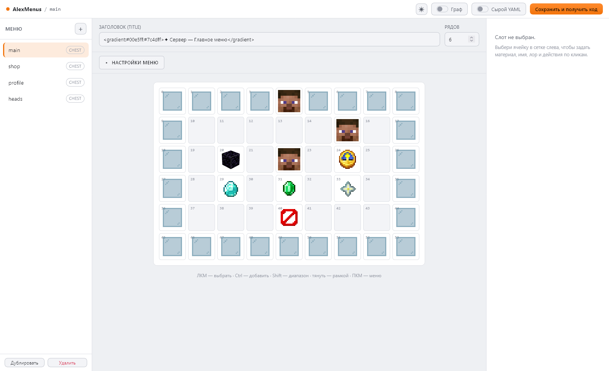
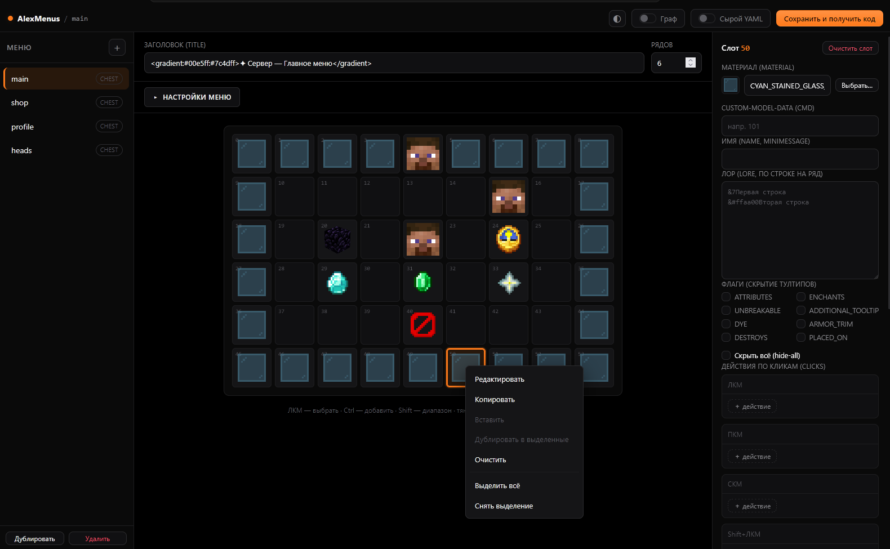

<div align="center">

# AlexMenus

**Движок меню для Paper 1.21.11 — с хостед веб-редактором в стиле LuckPerms.**
Сундук-GUI и меню-в-инвентаре, движок условий, действия, анимации.
Правки применяются **прямо из браузера** — порты на сервере открывать не надо.

[](../../releases)
[](https://papermc.io/)
[](https://adoptium.net/)
[](https://alexfirst404.github.io/alexmenus-wiki/)

**[⬇ Скачать](../../releases)** · **[📖 Документация](https://alexfirst404.github.io/alexmenus-wiki/)** · **[🎨 Редактор](https://alexfirst404.github.io/alexmenus-editor/)**

</div>



---

## Почему это удобно

|  |  |
|---|---|
| 🎨 **Редактируешь мышкой** | Сетка слотов один-в-один как чест-GUI, точные иконки предметов из ванилы, пикер всех блоков 1.21.11 |
| ⚡ **Применяется сразу** | `/am editor` → правишь → **«Применить»** → сервер сам записал и перезагрузил. Без копирования кодов |
| 🔒 **Ничего не открываешь наружу** | Плагин делает только **исходящие** HTTPS-запросы. Никаких портов, никакой панели на сервере |
| 🧩 **Условия без кода** | Права, деньги, плейсхолдеры, предметы, опыт — визуальным билдером или **node-графом** |

---

## Как это выглядит

<table>
<tr>
<td width="50%"><br><b>Граф навигации</b><br>Связи между меню, зум колёсиком, перетаскивание узлов</td>
<td width="50%"><br><b>Сырой YAML как в IDE</b><br>Подсветка синтаксиса и нумерация строк</td>
</tr>
<tr>
<td><br><b>Редактор предмета</b><br>Материал, имя, лор, флаги, действия по кликам, условия</td>
<td><br><b>Настройки меню</b><br>Права, команды, живое обновление, открывашка, анимация</td>
</tr>
<tr>
<td><br><b>Светлая тема</b><br>Переключается в шапке, запоминается</td>
<td><br><b>Мультивыделение и ПКМ-меню</b><br>Копирование, вставка в выделенные, массовая правка</td>
</tr>
</table>

---

## Возможности

**Меню**
- **`type: chest`** (GUI-сундук, 1–6 рядов) и **`type: inventory`** (меню в инвентаре игрока).
- **Цвета** в `title`/`name`/`lore`: легаси `&c&l`, hex `&#ff8800`, Bungee `&x&f&f…` **и** MiniMessage — вперемешку.
- **Команды меню** (`commands: [shop]`) как настоящие команды: tab-комплит, `/help`, `command-description`, `show-in-help`.
- **Права**: `permission:` — на всех путях открытия.
- **Живое обновление** (`update-interval`) — плейсхолдеры перерисовываются в открытом окне.
- **Аргументы команды** (`args`) — `/shop алмазы` → `{категория}` в заголовке, именах и действиях.
- **Предмет-открывашка** (`open-item`) — ПКМ по компасу в хотбаре открывает меню.

**Головы игроков** (`material: PLAYER_HEAD`)
- `head-owner` — ник; `%player_name%` / `{player}` → голова смотрящего (**работает и без PlaceholderAPI**).
- `head-uuid` — по UUID · `head-texture` — base64 / URL скина / hash (оффлайн, точный скин).
- Понимаются DeluxeMenus-префиксы `basehead-` / `texture-` / `head-` — конфиги мигрируют как есть.

**Анимации открытия**
- Темп — `speed: 1..100`; порядок — `sweep` · `rows` · `random` · **`corners`** (из четырёх углов) ·
  **`edges`** (сверху и снизу к центру) · **`ellipse`** (эллипс из центра к краям).

**Редактор**
- Пикер всех блоков/предметов 1.21.11 с поиском, точные иконки (блоки — 3D-рендер ванилы через deepslate).
- Головы — настоящее лицо скина. Граф навигации с зумом. Node-граф условий. Светлая тема.
- Сырой YAML с подсветкой и нумерацией. Свои модалки и чекбоксы. Мультивыделение и ПКМ-меню.

---

## Требования (`requirements`)

Три места для условий:

| Где | Ключ | Что делает |
|---|---|---|
| Предмет | `view-requirement` | Предмет **виден** только при выполнении условия |
| Предмет | `click-requirement` | **Гейт клика**: не выполнено → `deny`, иначе → `success` + действия |
| Меню | `open-requirement` | **Гейт открытия**: не выполнено → `deny`, меню не откроется |

Краткая форма (весь блок = условие) и полная (`require:` + `deny:`/`success:`):

```yaml
view-requirement: { type: permission, permission: alexmenus.vip }

click-requirement:
  require: { type: money, amount: 100 }
  deny:
    - type: message
      text: "&cНедостаточно денег"
```

Типы: `permission`, `placeholder` (`== != contains regex > < >= <=`; **обе стороны** через PAPI),
`money` (Vault), `has_item`, `exp` (очки/уровни), композиты `all` / `any` / `not`, флаг `negate`.
В редакторе — визуальным билдером, **node-графом** или raw-YAML.

## Действия

`run_command` · `message` · `broadcast` · `title` · `actionbar` · `open_menu` · `refresh` · `back` · `close` ·
`sound` · `give_item` · `give_money` / `take_money` (Vault) · `give_exp` / `take_exp` ·
`give_permission` / `take_permission` · `connect` (Bungee/Velocity) · `conditional`.

На любом действии — `chance: 0–100` и `delay: <тики>`.

---

## Установка

1. Скачай `AlexMenus-<версия>.jar` из **[Releases](../../releases)** → положи в `plugins/`.
2. Перезапусти сервер. Всё — **настраивать ничего не нужно**.

**Мягкие зависимости:** PlaceholderAPI, Vault, LuckPerms — подхватываются автоматически, если стоят.

## Как пользоваться

```
/am editor        → ссылка на редактор с live-сессией
                    правишь в браузере → «Применить» → сервер сам применил
/am apply <код>   → запасной путь: «Сохранить и получить код» в редакторе
```

Правки применяет **админ, начавший сессию** — ссылка живёт ограниченное время, а не «у кого ссылка, тот рулит».

**Команды:** `/am open <id> [игрок]` · `preview <id>` · `reload` · `editor` · `apply <код>` · `invclose [игрок]` · `info`
Алиасы: `/alexmenus`, `/alexmenu`, `/amenus`.
**Права:** `alexmenus.use`, `alexmenus.admin` + `permission` конкретного меню.

## Свой paste-воркер (необязательно)

По умолчанию используется общий публичный воркер — как у LuckPerms. Хочешь свой:
разверни [`cloudflare-worker/`](cloudflare-worker/) и впиши адрес в `config.yml`:

```yaml
editor:
  worker-url: ""   # пусто = общий публичный воркер
```

## Сборка из исходников

Paper 1.21.11 · Java 21 · Maven Wrapper:

```bash
./mvnw.cmd clean package
```

InvUI шейдится и релоцируется внутрь jar.

---

<div align="center">

**Документация:** [alexfirst404.github.io/alexmenus-wiki](https://alexfirst404.github.io/alexmenus-wiki/) ·
Исходники вики — в [`wiki/`](wiki/Home.md)

Этот репозиторий = хостед-редактор (GitHub Pages) + дистрибутив плагина + код paste-сервиса.

</div>
